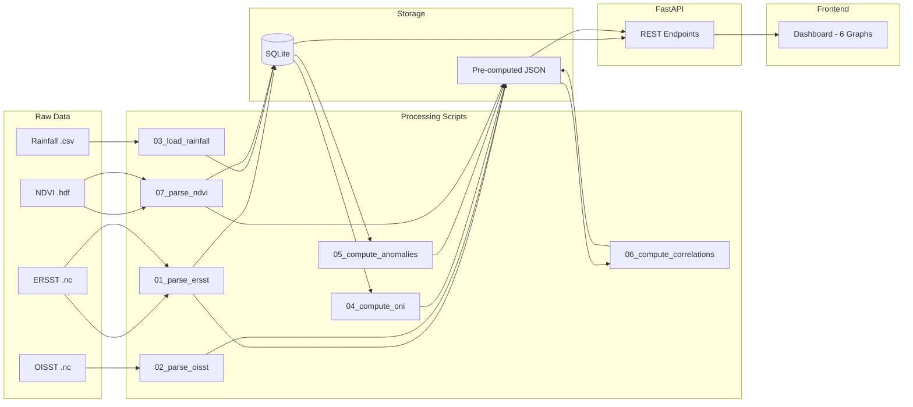

# Dataset & Backend Architecture

## 1. Raw Dataset Inventory

| # | Dataset | Source | Format | Resolution | Time Range | Size Estimate |
|---|---------|--------|--------|-----------|------------|---------------|
| D1 | **ERSST v6** | NOAA | Directory of `.nc` | 2° × 2° grid, monthly | 2000–2026 | ~50 MB total |
| D2 | **OISST v2.1 Anomalies** | NOAA | GeoTIFF (`.tif`) | 0.25° × 0.25° grid, weekly | 2000–2024 (approx) | ~20 MB |
| D3 | **CHIRPS Rainfall** | CHC | GeoTIFF (`.tif`) | 5km grid, monthly | 1981–present | ~150 MB |
| D4 | **MODIS NDVI** | NASA Terra/Aqua | GeoTIFF (`.tif`) | 2 km × 2.5 km, 48-day composite | 2000–2024 | ~500 MB |

### Download Sources

| Dataset | URL |
|---------|-----|
| ERSST v6 | Local Directory (`ersst_data/`) |
| OISST v2.1 | Local File (`OISST_v2_1_Nino_Weekly_Anomalies.tif`) |
| CHIRPS Rainfall | Local File (`CHIRPS_India_Monthly_Rainfall_5km.tif`) |
| MODIS NDVI | Local File (`MOD13A2_India_NDVI_48day_2000_2024.tif`) |

---

## 2. Directory Structure

```
project-root/
│
├── data/
│   ├── raw/                              ← IMMUTABLE originals
│   │   ├── ersst/
│   │   │   ├── ersst.v6.200001.nc
│   │   │   ├── ersst.v6.200002.nc
│   │   │   └── ...
│   │   ├── oisst/
│   │   │   └── OISST_v2_1_Nino_Weekly_Anomalies.tif
│   │   ├── rainfall/
│   │   │   ├── CHIRPS_India_Monthly_Rainfall_5km.tif
│   │   │   └── india_states.geojson     (Needed for spatial masking)
│   │   └── ndvi/
│   │       └── MOD13A2_India_NDVI_48day_2000_2024.tif
│   │
│   ├── db/
│   │   └── climate.db                    ← SQLite database
│   │
│   └── precomputed/                      ← JSON files for fast API serving
│       ├── oni/
│       │   ├── oni_timeseries.json
│       │   ├── phase_summary.json
│       │   └── derivation/
│       │       └── {year_month_range}.json
│       ├── sst/
│       │   ├── ersst/
│       │   │   ├── nov_2015.json
│       │   │   ├── nov_2020.json
│       │   │   └── nov_2023.json
│       │   └── oisst/
│       │       ├── nov_2015.json
│       │       ├── nov_2020.json
│       │       └── nov_2023.json
│       ├── rainfall/
│       │   ├── anomaly/
│       │   │   ├── 2009.json
│       │   │   ├── 2010.json
│       │   │   └── ...
│       │   └── cumulative/
│       │       ├── {state}_{year}.json
│       │       └── ...
│       ├── correlation/
│       │   ├── heatmap.json
│       │   └── scatter/
│       │       ├── maharashtra.json
│       │       ├── kerala.json
│       │       └── ...
│       └── ndvi/
│           ├── national_kharif.json
│           └── regional/
│               ├── north.json
│               ├── south.json
│               ├── east.json
│               ├── west.json
│               └── central.json
│
├── scripts/                              ← One-time processing pipeline
│   ├── 01_parse_ersst.py
│   ├── 02_parse_oisst.py
│   ├── 03_load_rainfall.py
│   ├── 04_compute_oni.py
│   ├── 05_compute_rainfall_anomalies.py
│   ├── 06_compute_correlations.py
│   └── 07_parse_ndvi.py
│
├── backend/                              ← FastAPI application
│   ├── main.py
│   ├── config.py
│   ├── database.py
│   └── routers/
│       ├── sst.py
│       ├── oni.py
│       ├── rainfall.py
│       ├── correlation.py
│       └── ndvi.py
│
└── frontend/                             ← React + D3/Plotly
    └── ...
```

---

## 3. SQLite Schema

### Table: `daily_rainfall`

Stores the core queryable rainfall data. **Note: To maintain API compatibility with the new CHIRPS dataset, monthly rainfall totals are stored on the 1st day of each month.** This supports the existing cumulative logic and date filters without changing the API schemas.

```sql
CREATE TABLE daily_rainfall (
    id          INTEGER PRIMARY KEY AUTOINCREMENT,
    state       TEXT    NOT NULL,
    date        DATE    NOT NULL,
    rainfall_mm REAL    NOT NULL,
    UNIQUE(state, date)
);

-- Fast lookups by state + date range (used by G3, G4)
CREATE INDEX idx_rainfall_state_date ON daily_rainfall(state, date);

-- Fast lookups by date across all states (used by animated map frames)
CREATE INDEX idx_rainfall_date ON daily_rainfall(date);
```

**Sample rows (Monthly CHIRPS data placed on the 1st of the month):**

| state | date | rainfall_mm |
|-------|------|-------------|
| Maharashtra | 2015-06-01 | 185.4 |
| Maharashtra | 2015-07-01 | 320.7 |
| Kerala | 2015-06-01 | 422.1 |

---

### Table: `oni_monthly`

Pre-computed ONI derivation. Each row = one month. Stores intermediate values so the derivation proof chart (G2 panel) can show all 4 lines.

```sql
CREATE TABLE oni_monthly (
    year_month      TEXT    PRIMARY KEY,  -- "2015-06"
    sst_raw         REAL    NOT NULL,     -- Raw area-avg SST in Niño 3.4
    climatology     REAL    NOT NULL,     -- 30-year base period average for that month
    anomaly         REAL    NOT NULL,     -- sst_raw - climatology
    oni             REAL    NOT NULL,     -- 3-month running mean of anomaly
    phase           TEXT    NOT NULL      -- "El Nino" / "La Nina" / "Neutral"
);

CREATE INDEX idx_oni_phase ON oni_monthly(phase);
```

**Phase classification logic:**

```
ONI ≥ +0.5 for 5+ consecutive months → El Niño
ONI ≤ −0.5 for 5+ consecutive months → La Niña
Otherwise → Neutral
```

---

### Table: `ndvi_regional`

Pre-aggregated NDVI by region. Raw rasters are spatially averaged into 5 regions during processing.

```sql
CREATE TABLE ndvi_regional (
    region          TEXT    NOT NULL,     -- "North" / "South" / "East" / "West" / "Central"
    composite_start DATE    NOT NULL,     -- Start date of 48-day composite window
    composite_end   DATE    NOT NULL,     -- End date of window
    mean_ndvi       REAL    NOT NULL,     -- Spatial average NDVI for that region
    ndvi_anomaly    REAL,                 -- Deviation from long-term mean for that period
    PRIMARY KEY (region, composite_start)
);

CREATE INDEX idx_ndvi_region ON ndvi_regional(region);
```

**Region definitions (state groupings):**

| Region | States Included |
|--------|----------------|
| North | J&K, Himachal, Punjab, Haryana, Uttarakhand, UP, Delhi |
| South | Kerala, Tamil Nadu, Karnataka, Andhra Pradesh, Telangana |
| East | West Bengal, Odisha, Bihar, Jharkhand, Assam, NE states |
| West | Rajasthan, Gujarat, Maharashtra, Goa |
| Central | MP, Chhattisgarh |

---

### Table: `rainfall_lpa`

Long Period Averages per state per month — the baseline for anomaly calculations.

```sql
CREATE TABLE rainfall_lpa (
    state       TEXT    NOT NULL,
    month       INTEGER NOT NULL,         -- 1-12
    lpa_mm      REAL    NOT NULL,         -- Average monthly rainfall (2009-2024 baseline)
    PRIMARY KEY (state, month)
);
```

---

## 4. Pre-computed JSON Schemas

### `oni/oni_timeseries.json`
Used by: **G2 (ONI Timeline)**

```json
{
  "data": [
    {
      "year_month": "2009-01",
      "oni": -0.8,
      "phase": "La Nina"
    },
    {
      "year_month": "2009-02",
      "oni": -0.7,
      "phase": "La Nina"
    }
  ]
}
```

### `sst/ersst/nov_2015.json`
Used by: **G1 (SST Heatmap — ERSST panel)**

```json
{
  "dataset": "ersst",
  "date": "2015-11",
  "grid": {
    "lat_range": [-5, 5],
    "lon_range": [-170, -120],
    "lat_step": 2.0,
    "lon_step": 2.0,
    "values": [
      {"lat": -4, "lon": -168, "sst": 28.4},
      {"lat": -4, "lon": -166, "sst": 28.9}
    ]
  }
}
```

### `sst/oisst/nov_2015.json`
Used by: **G1 (SST Heatmap — OISST panel)**

Same schema as above but with `lat_step: 0.25`, `lon_step: 0.25` and many more grid points. *(Note: Since the new dataset provides anomalies, the grid values represent anomalies even though they use the `sst` key for API compatibility).*

### `rainfall/anomaly/2015.json`
Used by: **G4 (Rainfall Anomaly Choropleth)**

```json
{
  "year": 2015,
  "season": "JJAS",
  "states": [
    {
      "state": "Maharashtra",
      "actual_mm": 780,
      "lpa_mm": 950,
      "deviation_pct": -17.9
    },
    {
      "state": "Kerala",
      "actual_mm": 1620,
      "lpa_mm": 1540,
      "deviation_pct": 5.2
    }
  ]
}
```

### `rainfall/cumulative/{state}_{year}.json`
Used by: **G3 (Embedded multi-line chart)**

```json
{
  "state": "Maharashtra",
  "year": 2015,
  "daily": [
    {"date": "2015-06-01", "daily_mm": 12.4, "cumulative_mm": 12.4},
    {"date": "2015-06-02", "daily_mm": 8.7,  "cumulative_mm": 21.1},
    {"date": "2015-06-03", "daily_mm": 0.0,  "cumulative_mm": 21.1}
  ]
}
```

### `correlation/heatmap.json`
Used by: **G5 (Heatmap tab)**

```json
{
  "states": ["Maharashtra", "Kerala", "UP", "..."],
  "pearson_r": [
    {"state": "Maharashtra", "r": -0.52, "p_value": 0.003},
    {"state": "Kerala",      "r": -0.38, "p_value": 0.041},
    {"state": "Rajasthan",   "r": -0.61, "p_value": 0.001}
  ]
}
```

### `correlation/scatter/{state}.json`
Used by: **G5 (Scatter tab)**

```json
{
  "state": "Maharashtra",
  "pearson_r": -0.52,
  "p_value": 0.003,
  "regression": {"slope": -12.3, "intercept": 2.1},
  "points": [
    {"year": 2009, "oni": -0.8, "anomaly_pct": 15.2, "phase": "La Nina"},
    {"year": 2010, "oni": -1.2, "anomaly_pct": 22.4, "phase": "La Nina"},
    {"year": 2015, "oni": 2.2,  "anomaly_pct": -17.9, "phase": "El Nino"}
  ]
}
```

### `ndvi/regional/{region}.json`
Used by: **G6 (NDVI vs ONI)**

```json
{
  "region": "South",
  "season_filter": "kharif",
  "data": [
    {
      "composite_start": "2015-06-10",
      "mean_ndvi": 0.42,
      "ndvi_anomaly": -0.08,
      "oni": 1.5
    },
    {
      "composite_start": "2015-07-28",
      "mean_ndvi": 0.38,
      "ndvi_anomaly": -0.12,
      "oni": 1.8
    }
  ]
}
```

---

## 5. Processing Pipeline Scripts

Run in order. Each script reads from `data/raw/`, writes to `data/db/` and/or `data/precomputed/`.

### `01_parse_ersst.py`

```
Input:  data/raw/ersst/*.nc (directory of monthly files)
Output: data/precomputed/sst/ersst/*.json
        data/db/climate.db → oni_monthly table (intermediate)

Steps:
  1. Loop through all `.nc` files in `data/raw/ersst/` and concatenate with xarray
  2. Crop to Niño 3.4 (5°N–5°S, 170°W–120°W)
  3. For event months (Nov 2015/2020/2023): extract grid → write JSON
  4. Compute area-weighted monthly mean SST → store as sst_raw
  5. Compute climatology (2000–2024 base) per calendar month
  6. Compute anomaly = sst_raw − climatology
  7. Compute 3-month running mean → ONI
  8. Classify phase (El Niño / La Niña / Neutral)
  9. Insert into oni_monthly table
```

### `02_parse_oisst.py`

```
Input:  data/raw/oisst/OISST_v2_1_Nino_Weekly_Anomalies.tif
Output: data/precomputed/sst/oisst/*.json

Steps:
  1. Open GeoTIFF with rasterio
  2. (Data is already weekly anomalies cropped to Niño 3.4 region)
  3. For event months: extract grid cell anomalies (mapped to 'sst' key in JSON to keep API format) → write JSON
  (No DB writes — OISST is only used for G1 visual comparison)
```

### `03_load_rainfall.py`

```
Input:  data/raw/rainfall/CHIRPS_India_Monthly_Rainfall_5km.tif
        data/raw/rainfall/india_states.geojson
Output: data/db/climate.db → daily_rainfall table
                            → rainfall_lpa table

Steps:
  1. Load India states GeoJSON using geopandas
  2. Open CHIRPS GeoTIFF with rasterio
  3. Use rasterstats or rioxarray to compute spatial average rainfall per state for each monthly band
  4. Format dates to the 1st of each month (e.g., YYYY-MM-01) to maintain API compatibility
  5. Bulk insert into daily_rainfall table
  6. Compute LPA: group by (state, month), take mean over 2000–2024
  7. Insert into rainfall_lpa table
```

### `04_compute_oni.py`

```
Input:  data/db/climate.db → oni_monthly table
Output: data/precomputed/oni/oni_timeseries.json
        data/precomputed/oni/phase_summary.json
        data/precomputed/oni/derivation/*.json

Steps:
  1. Read oni_monthly from SQLite
  2. Write full series → oni_timeseries.json
  3. Compute phase summary (% El Niño/La Niña/Neutral per decade) → phase_summary.json
  4. For each possible brush window: pre-compute derivation proof data
     (or compute on-the-fly via API — see Section 6)
```

### `05_compute_rainfall_anomalies.py`

```
Input:  data/db/climate.db → daily_rainfall + rainfall_lpa
Output: data/precomputed/rainfall/anomaly/{year}.json
        data/precomputed/rainfall/cumulative/{state}_{year}.json

Steps:
  1. For each year (2009–2024):
     a. Sum JJAS rainfall per state
     b. Join with LPA, compute % deviation
     c. Write anomaly/{year}.json
  2. For each (state, year):
     a. Query daily rainfall Jun–Oct
     b. Compute running cumulative sum
     c. Write cumulative/{state}_{year}.json
```

### `06_compute_correlations.py`

```
Input:  data/precomputed/rainfall/anomaly/*.json
        data/precomputed/oni/oni_timeseries.json
Output: data/precomputed/correlation/heatmap.json
        data/precomputed/correlation/scatter/{state}.json

Steps:
  1. For each state:
     a. Collect (JJAS-avg ONI, JJAS rainfall anomaly %) pairs across all years
     b. Compute Pearson r and p-value (scipy.stats.pearsonr)
     c. Fit OLS regression (numpy.polyfit)
     d. Write scatter/{state}.json
  2. Combine all states' r values → heatmap.json
```

### `07_parse_ndvi.py`

```
Input:  data/raw/ndvi/MOD13A2_India_NDVI_48day_2000_2024.tif
Output: data/db/climate.db → ndvi_regional table
        data/precomputed/ndvi/regional/{region}.json
        data/precomputed/ndvi/national_kharif.json

Steps:
  1. Open the single multi-band GeoTIFF with rasterio (each band = one composite period)
  2. Mask to India regions (using a shapefile/GeoJSON)
  3. For each band:
     a. Compute spatial average by region (North/South/East/West/Central)
     b. Resolve the date for the composite period
     c. Insert into ndvi_regional table
  4. Join with ONI data by nearest date
  5. Filter to Kharif (Jun–Oct) composites
  6. Compute long-term NDVI mean per region per composite period
  7. Compute NDVI anomaly
  8. Write regional JSONs + national aggregate
```

---

## 6. FastAPI Backend

### `main.py` — App Setup

```python
from fastapi import FastAPI
from fastapi.middleware.cors import CORSMiddleware
from routers import sst, oni, rainfall, correlation, ndvi

app = FastAPI(title="ENSO-Monsoon Analytics API")

app.add_middleware(
    CORSMiddleware,
    allow_origins=["*"],
    allow_methods=["*"],
    allow_headers=["*"],
)

app.include_router(sst.router,         prefix="/api/sst",         tags=["SST"])
app.include_router(oni.router,         prefix="/api/oni",         tags=["ONI"])
app.include_router(rainfall.router,    prefix="/api/rainfall",    tags=["Rainfall"])
app.include_router(correlation.router, prefix="/api/correlation", tags=["Correlation"])
app.include_router(ndvi.router,        prefix="/api/ndvi",        tags=["NDVI"])
```

### API Endpoints

#### SST Router (`routers/sst.py`)

| Method | Endpoint | Params | Source | Used By |
|--------|----------|--------|--------|---------|
| GET | `/api/sst/grid` | `dataset` (ersst/oisst), `event` (nov_2015/nov_2020/nov_2023) | JSON file | G1 |

```python
@router.get("/grid")
def get_sst_grid(dataset: str = "ersst", event: str = "nov_2015"):
    path = PRECOMPUTED / "sst" / dataset / f"{event}.json"
    return json.loads(path.read_text())
```

---

#### ONI Router (`routers/oni.py`)

| Method | Endpoint | Params | Source | Used By |
|--------|----------|--------|--------|---------|
| GET | `/api/oni/timeseries` | — | JSON file | G2 main chart |
| GET | `/api/oni/details` | `start`, `end` (year-month) | SQLite query | G2 slide-out panel |
| GET | `/api/oni/phase-summary` | `start`, `end` | SQLite query | G2 donut chart |

```python
@router.get("/timeseries")
def get_oni_timeseries():
    path = PRECOMPUTED / "oni" / "oni_timeseries.json"
    return json.loads(path.read_text())

@router.get("/details")
def get_oni_details(start: str, end: str):
    """Returns raw SST, climatology, anomaly, ONI for derivation proof chart."""
    rows = db.execute(
        "SELECT * FROM oni_monthly WHERE year_month BETWEEN ? AND ? ORDER BY year_month",
        (start, end)
    ).fetchall()
    return {"data": [dict(r) for r in rows]}

@router.get("/phase-summary")
def get_phase_summary(start: str, end: str):
    """Returns donut chart data: count of El Niño / La Niña / Neutral months."""
    rows = db.execute(
        "SELECT phase, COUNT(*) as count FROM oni_monthly "
        "WHERE year_month BETWEEN ? AND ? GROUP BY phase",
        (start, end)
    ).fetchall()
    return {"phases": [dict(r) for r in rows]}
```

---

#### Rainfall Router (`routers/rainfall.py`)

| Method | Endpoint | Params | Source | Used By |
|--------|----------|--------|--------|---------|
| GET | `/api/rainfall/anomaly` | `year` | JSON file | G4 |
| GET | `/api/rainfall/cumulative` | `state`, `year` | JSON file | G3 line chart |
| GET | `/api/rainfall/animation-frame` | `year`, `date` | SQLite query | G3 animated map |

```python
@router.get("/anomaly")
def get_anomaly(year: int):
    path = PRECOMPUTED / "rainfall" / "anomaly" / f"{year}.json"
    return json.loads(path.read_text())

@router.get("/cumulative")
def get_cumulative(state: str, year: int):
    path = PRECOMPUTED / "rainfall" / "cumulative" / f"{state}_{year}.json"
    return json.loads(path.read_text())

@router.get("/animation-frame")
def get_animation_frame(year: int, start_date: str, end_date: str):
    """Returns per-state rainfall for one animation frame window."""
    rows = db.execute("""
        SELECT state,
               SUM(rainfall_mm) as current_rain,
               (SELECT SUM(r2.rainfall_mm) FROM daily_rainfall r2
                WHERE r2.state = r.state AND r2.date BETWEEN ? AND ?)
               as cumulative_rain
        FROM daily_rainfall r
        WHERE r.date BETWEEN ? AND ?
        GROUP BY state
    """, (f"{year}-01-01", end_date, start_date, end_date)).fetchall()
    return {"frame": [dict(r) for r in rows]}
```

> [!TIP]
> For the animated map, you can either:
> - **Pre-compute all frames** as JSON (fastest, ~20 files per year × 16 years = 320 files), or
> - **Query SQLite on-the-fly** per frame (simpler, still fast enough for ~36 states)
>
> Recommendation: **pre-compute** for smooth playback.

---

#### Correlation Router (`routers/correlation.py`)

| Method | Endpoint | Params | Source | Used By |
|--------|----------|--------|--------|---------|
| GET | `/api/correlation/heatmap` | — | JSON file | G5 heatmap tab |
| GET | `/api/correlation/scatter` | `state` | JSON file | G5 scatter tab |

```python
@router.get("/heatmap")
def get_heatmap():
    path = PRECOMPUTED / "correlation" / "heatmap.json"
    return json.loads(path.read_text())

@router.get("/scatter")
def get_scatter(state: str):
    path = PRECOMPUTED / "correlation" / "scatter" / f"{state}.json"
    return json.loads(path.read_text())
```

---

#### NDVI Router (`routers/ndvi.py`)

| Method | Endpoint | Params | Source | Used By |
|--------|----------|--------|--------|---------|
| GET | `/api/ndvi/regional` | `region` | JSON file | G6 |
| GET | `/api/ndvi/national` | — | JSON file | G6 |

```python
@router.get("/regional")
def get_regional(region: str = "south"):
    path = PRECOMPUTED / "ndvi" / "regional" / f"{region}.json"
    return json.loads(path.read_text())

@router.get("/national")
def get_national():
    path = PRECOMPUTED / "ndvi" / "national_kharif.json"
    return json.loads(path.read_text())
```

---

## 7. Python Dependencies

```
# requirements.txt
fastapi==0.115.*
uvicorn==0.34.*
xarray==2025.*
netCDF4==1.7.*
rasterio==1.4.*
geopandas==1.0.*
pandas==2.2.*
numpy==2.1.*
scipy==1.14.*
```

### Run the backend

```bash
# Process data (one-time)
python scripts/01_parse_ersst.py
python scripts/02_parse_oisst.py
python scripts/03_load_rainfall.py
python scripts/04_compute_oni.py
python scripts/05_compute_rainfall_anomalies.py
python scripts/06_compute_correlations.py
python scripts/07_parse_ndvi.py

# Start API server
uvicorn backend.main:app --reload --port 8000
```

---

## 8. Data Flow Summary


